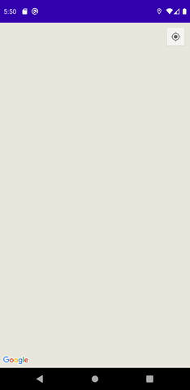
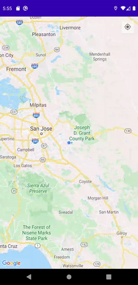
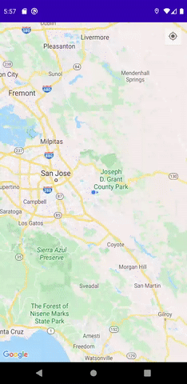
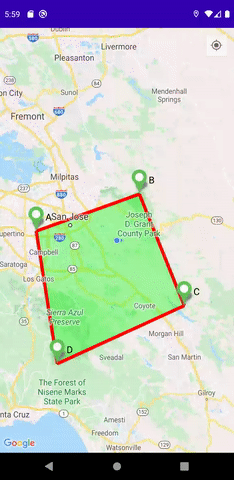

# Map-Android-Assignment-1
This is an Android Application where the user can interact with Google Map. 
Created as a Advanced Android Development Assignment 1 with requirements:
* Add markers by tapping on a map for four points. Connect each point with a straight line of red colour and fill the area created by the quadrilateral with green colour (35% transparency). 
* Beside each city add letters: A, B, C, and D.
* Thoroughfare, sub thoroughfare and postal code should be the title of the marker
* City and province should be the snippet of the marker
* A quadrilateral should be formed, regardless of the order of markers added on the map
* When user taps on any of the lines, the distance between the two cities should be displayed beside each line.
* When the user taps in the middle of the quadrilateral created by the lines, the total distance is displayed (A – B – C – D).
* If the user applies a long press on the same location (or close by) the application should remove the location from the map as well as the lines and quadrilateral.
* The user should be able to drag the markers too.

 

### Adding a Marker:
The app adds Marker by a Click on the Map. The App adds the Maker on the app and then adds the Title and Snippet Asynchronously so that the Gecoding process does not slow down the application.
 

  
### Adding Polylines and Polygons:
A quadrilateral is formed regardless of the order of markers added on the map, as the points is sorted clockwise before creating the polygon
 

&emsp; &emsp;

  
### Adding Polylines and Polygons:
Clicking on Polyline shows the distance of the polyline. Clicking on Polygon shows the distance from A to B + B to C + C to D
 

&emsp; &emsp;

  
### Dragging a Marker:
Dragging a Marker changes Polylines associated with it and also polygon associated with. It also changes the Title and Snippet Asynchronously
 

  
### Deleting a Marker:
Long Clicking near the Marker removes the marker and Polylines and Polygons associated with it
 

